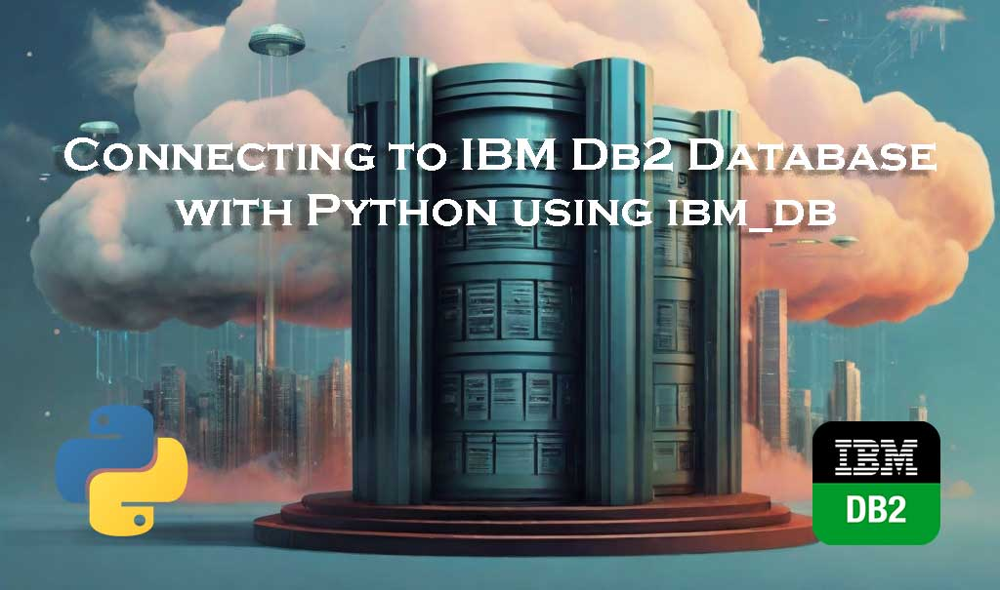
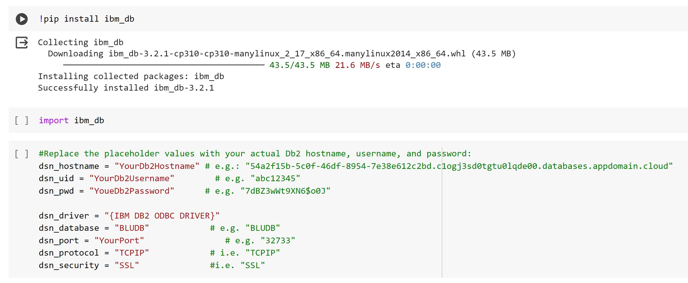
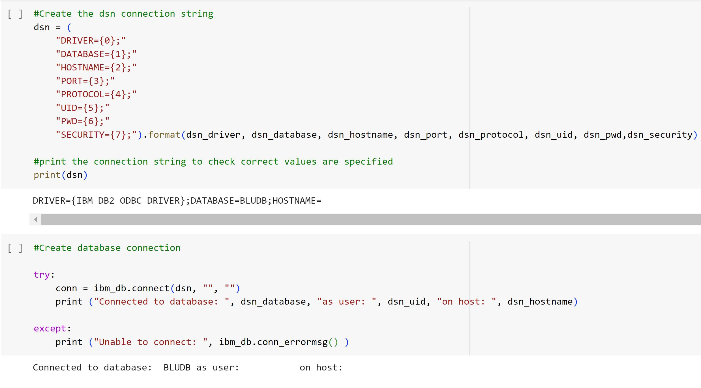
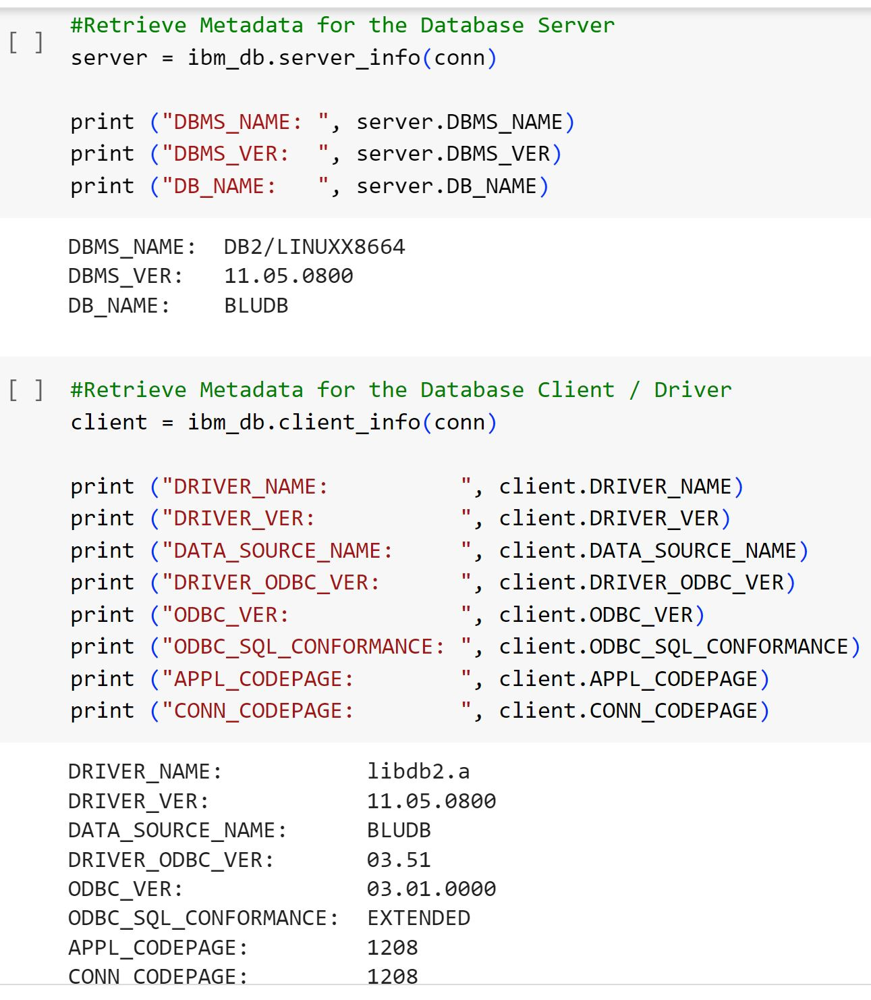
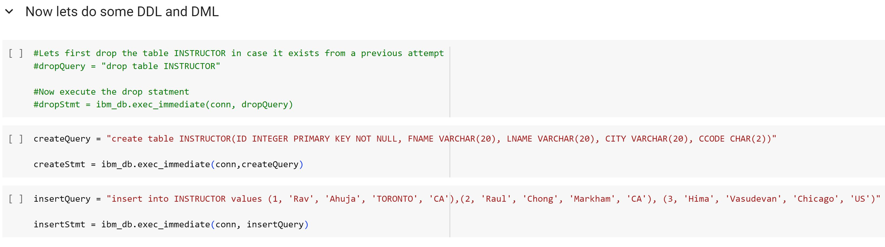
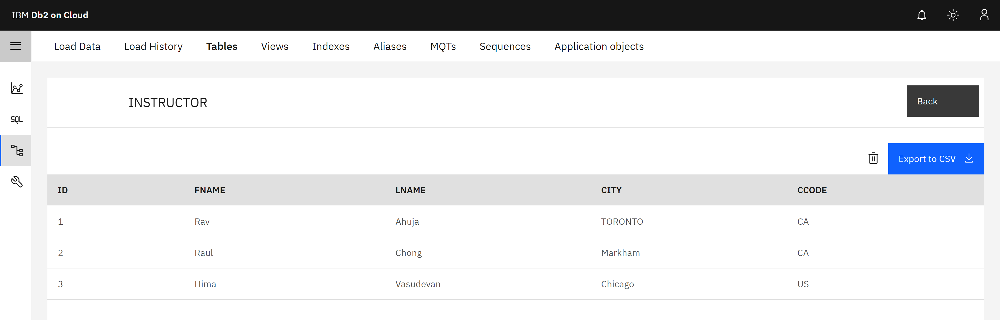
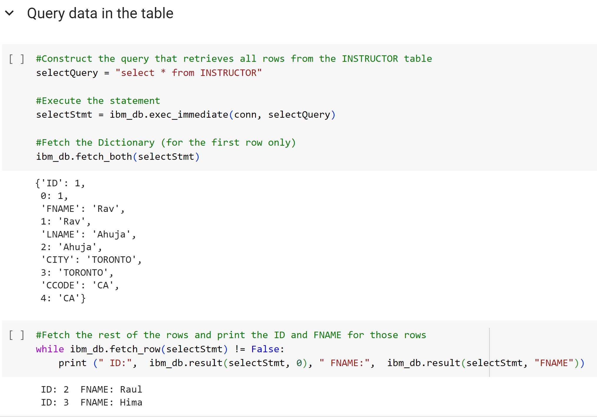
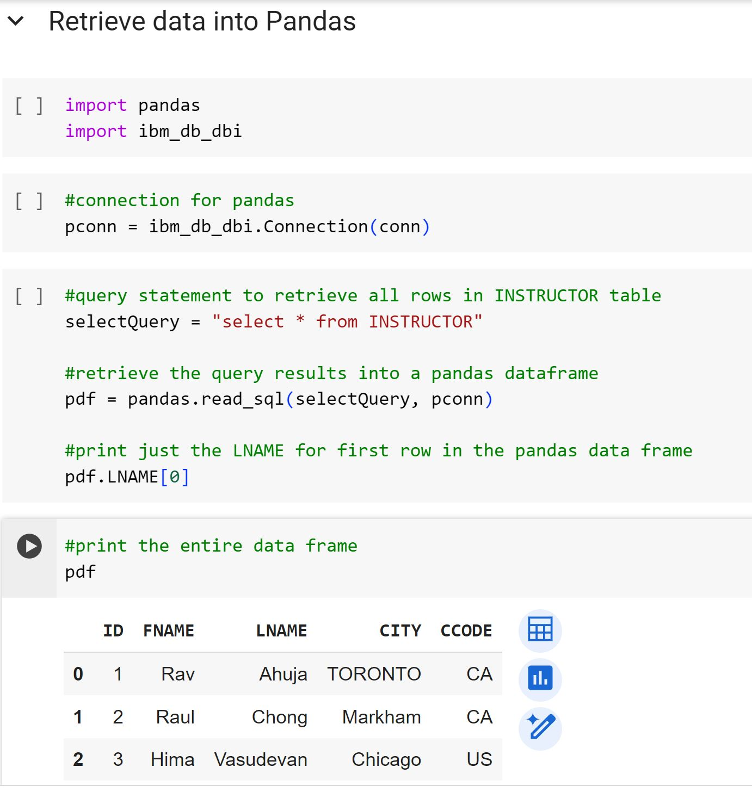
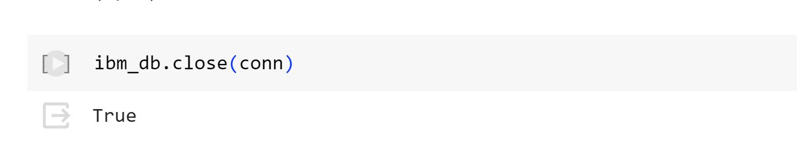

# Connecting-to-IBM-Db2-Database-with-Python-using-ibm_db

## Overview

This project demonstrates the usage of the ibm_db API in Python for interacting with an IBM® data server database, particularly focusing on connecting to Db2 databases in the cloud environment. The ibm_db library offers a collection of functions tailored for accessing and managing data within an IBM® data server database.

## Project Description

This project showcases a step-by-step guide on connecting to a Db2 database on the cloud using Python with the ibm_db library. It covers various essential tasks involved in database interaction, including creating a connection, executing SQL statements, manipulating data, and retrieving results using pandas DataFrames.

## Features

- **Database Connection**: Demonstrates establishing a connection to an IBM Db2 database in the cloud.
- **SQL Operations**: Shows examples of executing SQL queries, creating tables, inserting data, and querying data from the database.
- **Pandas DataFrame Integration**: Illustrates fetching query results into pandas DataFrames for easy data manipulation and analysis.

## Technologies Used

- Python
- ibm_db Python library
- IBM Db2 Database (Cloud)
- Pandas library

## Connect to Db2 database on Cloud using Python

Install and Import the Ibm-db2 library

Create the dsn connection string and create a database connection

Retrieve Metadata for the Database

Running basic DDL and DML 

Created Table on the Db2 Cloud

Querying the Table

Retrieve data into Pandas

Close Connection to database

***NOTE*** : Closing connections to APIs or databases in Python is essential. It ensures efficient resource usage, prevents potential system limitations, maintains data integrity, avoids errors, and aligns with good coding practices in software development.

